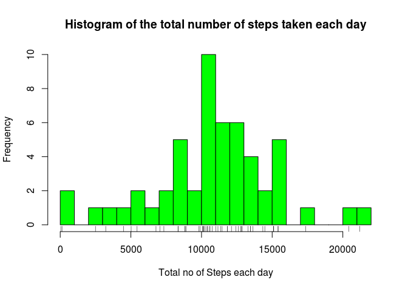
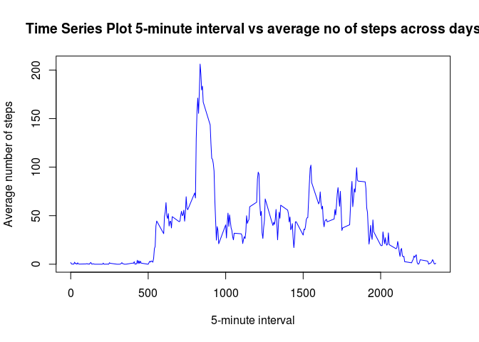
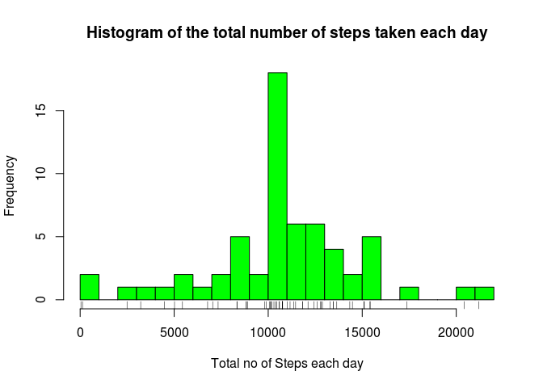
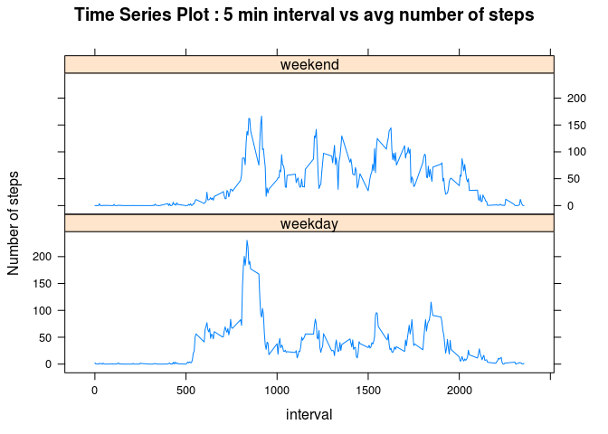

# Reproducible Reasearch Peer_Assesment 1
Rajesh Sikdar  
15 October 2015  
###**Loading the neccessay packages**


```r
library("dplyr")
```

```
## 
## Attaching package: 'dplyr'
## 
## The following objects are masked from 'package:stats':
## 
##     filter, lag
## 
## The following objects are masked from 'package:base':
## 
##     intersect, setdiff, setequal, union
```

```r
library("lattice")
Sys.setlocale("LC_ALL","English")
```

```
## Warning in Sys.setlocale("LC_ALL", "English"): OS reports request to set
## locale to "English" cannot be honored
```


###**Loading and preprocessing the data**

**1.Load the data activity.csv file from your current folder**
   


```r
data <- read.csv("activity.csv",header = TRUE)
summary(data)
```

```
##      steps                date          interval     
##  Min.   :  0.00   2012-10-01:  288   Min.   :   0.0  
##  1st Qu.:  0.00   2012-10-02:  288   1st Qu.: 588.8  
##  Median :  0.00   2012-10-03:  288   Median :1177.5  
##  Mean   : 37.38   2012-10-04:  288   Mean   :1177.5  
##  3rd Qu.: 12.00   2012-10-05:  288   3rd Qu.:1766.2  
##  Max.   :806.00   2012-10-06:  288   Max.   :2355.0  
##  NA's   :2304     (Other)   :15840
```

2.Process the data 


```r
# Removing Missing Values
data_no_na <- data[complete.cases(data),]
summary(data_no_na)
```

```
##      steps                date          interval     
##  Min.   :  0.00   2012-10-02:  288   Min.   :   0.0  
##  1st Qu.:  0.00   2012-10-03:  288   1st Qu.: 588.8  
##  Median :  0.00   2012-10-04:  288   Median :1177.5  
##  Mean   : 37.38   2012-10-05:  288   Mean   :1177.5  
##  3rd Qu.: 12.00   2012-10-06:  288   3rd Qu.:1766.2  
##  Max.   :806.00   2012-10-07:  288   Max.   :2355.0  
##                   (Other)   :13536
```

###**What is mean total number of steps taken per day**

**1.Calculates the Total of steps per day**


```r
# rows are grouped by date and sum of steps is taken for each day.
no_of_steps <- data_no_na %>% 
               select(steps,date) %>%
               group_by(date) %>% 
               summarise_each(funs(sum))
summary(no_of_steps)
```

```
##          date        steps      
##  2012-10-02: 1   Min.   :   41  
##  2012-10-03: 1   1st Qu.: 8841  
##  2012-10-04: 1   Median :10765  
##  2012-10-05: 1   Mean   :10766  
##  2012-10-06: 1   3rd Qu.:13294  
##  2012-10-07: 1   Max.   :21194  
##  (Other)   :47
```

**2.Plot the Histogram of the total number of steps taken each day**


```r
# histogarm is ploted with 30 breaks to get a descent graph
hist(no_of_steps$steps,
     col="green",
     xlab ="Total no of Steps each day",
     main ="Histogram of the total number of steps taken each day",
     breaks=30
     )

# Rug is added to get clearer picture
rug(no_of_steps$steps)
```

 

**3.Calculate and report the mean and median of the total number of steps taken per day**
  

```r
# calculating mean
mean <- mean(no_of_steps$steps)

# calculating median 
median <- median(no_of_steps$steps)
```

The **mean** for total number of steps taken per day is **1.0766189\times 10^{4}**.   
The **median** for total number of steps taken per day is **10765**.

###**What is the average daily activity pattern?**

**1.Make a time series plot (i.e. type = "l") of the 5-minute interval (x-axis) and the average number of steps taken, averaged across all days (y-axis)**

To make this plot we need another dataframe with average number of steps for           5-minute interval  averaged across all days


```r
avg_no_of_steps_interval <- data_no_na %>% 
                            select(steps,interval) %>%
                            group_by(interval) %>% 
                            summarise_each(funs(mean))
```

Make the time series plot  


```r
plot(avg_no_of_steps_interval$interval,avg_no_of_steps_interval$steps,
      type="l",
      main="Time Series Plot 5-minute interval vs average no of steps across days",
      xlab="5-minute interval",
      ylab="Average number of steps",
      col="blue"
    )
```

 
 
**2.Which 5-minute interval, on average across all the days in the dataset, contains the maximum number of steps?**


```r
max_interval <- avg_no_of_steps_interval[which.max(avg_no_of_steps_interval$steps),1]
```

The 5-minute interval which contains the maximun number of steps is **835**
  
###**Imputing missing values**

**1.Calculate and report the total number of missing values in the dataset (i.e. the total number of rows with NAs)**


```r
count_of_missing_row <- nrow(data[is.na(data$steps),])
```

The total number of missing values in the dataset is **2304**

**2.Devise a strategy for filling in all of the missing values in the dataset. The      strategy does not need to be sophisticated. For example, you could use the             mean/median for that day, or the mean for that 5-minute interval, etc.**

For this I have first created a dataframe of missing values ( missing_data )
to this dataframe impute the missing no of steps values ( by merging ) from the        earlier dataframe (avg_no_of_steps_interval) which has avg no of steps based on the    interval across days


```r
missing_data <- data[is.na(data$steps),]

imputed_data <- merge(missing_data,avg_no_of_steps_interval,by="interval",all.x=T)

imputed_data <- select(imputed_data,steps=steps.y,date,interval) 

summary(imputed_data)
```

```
##      steps                 date        interval     
##  Min.   :  0.000   2012-10-01:288   Min.   :   0.0  
##  1st Qu.:  2.486   2012-10-08:288   1st Qu.: 588.8  
##  Median : 34.113   2012-11-01:288   Median :1177.5  
##  Mean   : 37.383   2012-11-04:288   Mean   :1177.5  
##  3rd Qu.: 52.835   2012-11-09:288   3rd Qu.:1766.2  
##  Max.   :206.170   2012-11-10:288   Max.   :2355.0  
##                    (Other)   :576
```

**3.Create a new dataset that is equal to the original dataset but with the missing data filled in.**

We now use the imputed dataframe created earlier to bind with the non missing dataframe


```r
new_data <- rbind(data_no_na,imputed_data)
summary(new_data)
```

```
##      steps                date          interval     
##  Min.   :  0.00   2012-10-01:  288   Min.   :   0.0  
##  1st Qu.:  0.00   2012-10-02:  288   1st Qu.: 588.8  
##  Median :  0.00   2012-10-03:  288   Median :1177.5  
##  Mean   : 37.38   2012-10-04:  288   Mean   :1177.5  
##  3rd Qu.: 27.00   2012-10-05:  288   3rd Qu.:1766.2  
##  Max.   :806.00   2012-10-06:  288   Max.   :2355.0  
##                   (Other)   :15840
```

**4.Make a histogram of the total number of steps taken each day and Calculate and report the mean and median total number of steps taken per day. Do these values differ from the estimates from the first part of the assignment? What is the impact of imputing missing data on the estimates of the total daily number of steps?**

Calculates the Total of steps per day


```r
# rows are grouped by date and sum of steps is taken for each day.
new_no_of_steps <- new_data %>% 
               select(steps,date) %>%
               group_by(date) %>% 
               summarise_each(funs(sum))

summary(new_no_of_steps)
```

```
##          date        steps      
##  2012-10-01: 1   Min.   :   41  
##  2012-10-02: 1   1st Qu.: 9819  
##  2012-10-03: 1   Median :10766  
##  2012-10-04: 1   Mean   :10766  
##  2012-10-05: 1   3rd Qu.:12811  
##  2012-10-06: 1   Max.   :21194  
##  (Other)   :55
```

Plot the Histogram of the total number of steps taken each day


```r
# histogarm is ploted with 30 breaks to get a descent graph
hist(new_no_of_steps$steps,
     col="green",
     xlab ="Total no of Steps each day",
     main ="Histogram of the total number of steps taken each day",
     breaks=30
     )

# Rug is added to get clearer picture
rug(new_no_of_steps$steps)
```

 

**3.Calculate and report the mean and median of the total number of steps taken per day**
  

```r
# calculating mean
new_mean <- mean(new_no_of_steps$steps)

# calculating median 
new_median <- median(new_no_of_steps$steps)
```

The **mean** for total number of steps taken per day is **1.0766189\times 10^{4}**.   
The **median** for total number of steps taken per day is **1.0766189\times 10^{4}**.

###**Are there differences in activity patterns between weekdays and weekends?**

**1.Create a new factor variable (day ) in the dataset with two levels – “weekday” and “weekend” indicating whether a given date is a weekday or weekend day.**


```r
#new_data$day <- sapply(new_data[,2], function(x) (as.Date(new_data[,2],"%Y-%m-%d")))
for (i in 1:nrow(new_data)){
  
temp_day <- weekdays(as.Date(new_data[i,"date"], "%Y-%m-%d"))
  
   if (temp_day == "Sunday")  { 
    
        new_data[i,"day"]  <- "weekend" 
       
   }else if (temp_day == "Saturday") {
       
        new_data[i,"day"]  <- "weekend"
     
   }else {  
        new_data[i,"day"]  <- "weekday"  
      }        
}

new_data$day <- as.factor(new_data$day)

summary(new_data)
```

```
##      steps                date          interval           day       
##  Min.   :  0.00   2012-10-01:  288   Min.   :   0.0   weekday:12960  
##  1st Qu.:  0.00   2012-10-02:  288   1st Qu.: 588.8   weekend: 4608  
##  Median :  0.00   2012-10-03:  288   Median :1177.5                  
##  Mean   : 37.38   2012-10-04:  288   Mean   :1177.5                  
##  3rd Qu.: 27.00   2012-10-05:  288   3rd Qu.:1766.2                  
##  Max.   :806.00   2012-10-06:  288   Max.   :2355.0                  
##                   (Other)   :15840
```


**2.Make a panel plot containing a time series plot (i.e. type = "l") of the 5-minute interval (x-axis) and the average number of steps taken, averaged across all weekday days or weekend days (y-axis).**

For this we need a new dataframe created from new_data with the weekend and weekday    grouped on interval, day and summarized on avg number of steps taken.


```r
new_avg_no_of_steps_interval <- new_data %>% 
                            select(steps,interval,day) %>%
                            group_by(interval,day) %>% 
                            summarise_each(funs(mean))

summary(new_avg_no_of_steps_interval)
```

```
##     interval           day          steps        
##  Min.   :   0.0   weekday:288   Min.   :  0.000  
##  1st Qu.: 588.8   weekend:288   1st Qu.:  2.047  
##  Median :1177.5                 Median : 28.133  
##  Mean   :1177.5                 Mean   : 38.988  
##  3rd Qu.:1766.2                 3rd Qu.: 61.263  
##  Max.   :2355.0                 Max.   :230.378
```
  

Plot the time series plot ussing lattice


```r
xyplot(steps ~ interval | day, 
       data=new_avg_no_of_steps_interval,
       type="l",
       layout=c(1,2),
       xlab="interval",
       ylab="Number of steps",
       main="Time Series Plot : 5 min interval vs avg number of steps"
       )
```

 

  
